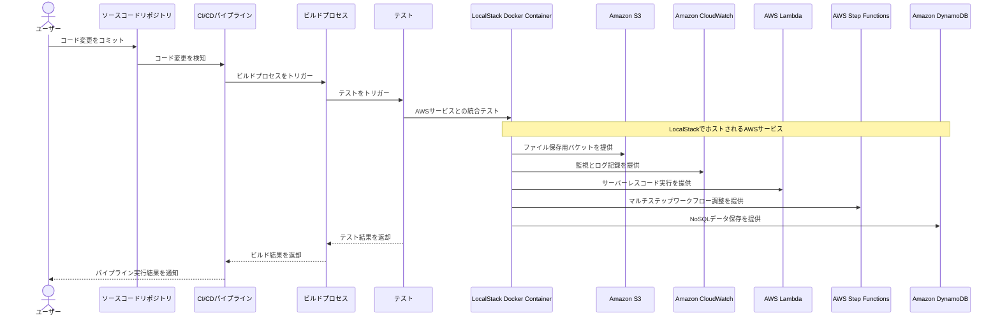

# Testing AWS infrastructure using LocalStack and Terraform Test

## アーキテクチャ図

ADR を参照する？

## シーケンス図

テストのシーケンス図になっているので修正する。

AI でサクッと作れるので AI に作らせること。

```mermaid
sequenceDiagram
    actor User as ユーザー
    participant Repo as ソースコードリポジトリ
    participant CICD as CI/CDパイプライン
    participant Build as ビルドプロセス
    participant Test as テスト
    participant LocalStack as LocalStack Docker Container
    participant S3 as Amazon S3
    participant CloudWatch as Amazon CloudWatch
    participant Lambda as AWS Lambda
    participant StepFunctions as AWS Step Functions
    participant DynamoDB as Amazon DynamoDB

    User->>Repo: コード変更をコミット
    Repo->>CICD: コード変更を検知
    CICD->>Build: ビルドプロセスをトリガー
    Build->>Test: テストをトリガー
    Test->>LocalStack: AWSサービスとの統合テスト

    Note over LocalStack,DynamoDB: LocalStackでホストされるAWSサービス

    LocalStack->>S3: ファイル保存用バケットを提供
    LocalStack->>CloudWatch: 監視とログ記録を提供
    LocalStack->>Lambda: サーバーレスコード実行を提供
    LocalStack->>StepFunctions: マルチステップワークフロー調整を提供
    LocalStack->>DynamoDB: NoSQLデータ保存を提供

    Test-->>Build: テスト結果を返却
    Build-->>CICD: ビルド結果を返却
    CICD-->>User: パイプライン実行結果を通知
```

## 概要説明
